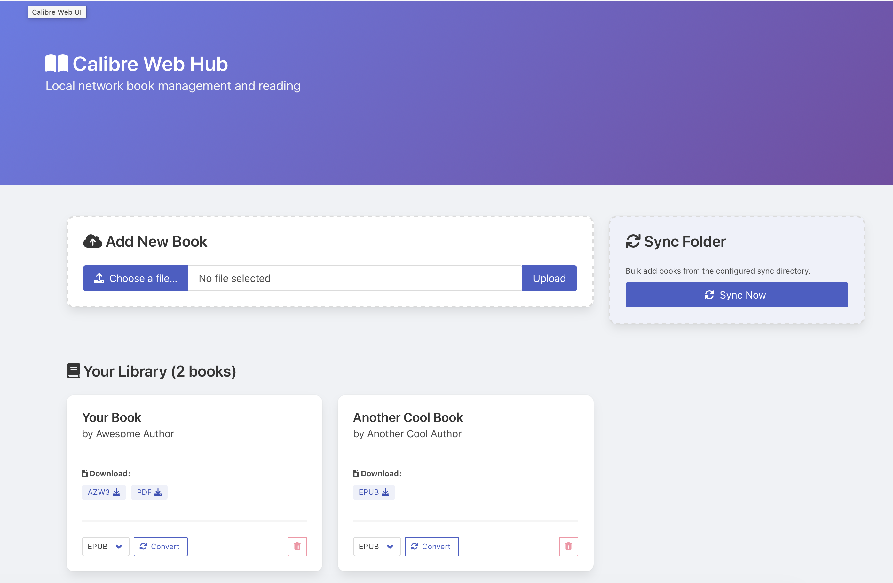

# Home Assistant Add-on: Calibre Web UI

[](https://github.com/prlz77/ha-calibre/actions/workflows/ci.yml)
[](https://github.com/pre-commit/pre-commit)
[](https://www.buymeacoffee.com/prlz77)

I maintain this Home Assistant add-on in my free time. Keeping up with upstream changes, Home Assistant updates, and testing on real devices takes time and effort.

If this add-on saves you time, makes your ebook setup easier, or helps you bridge the gap between Calibre and your family's Kindles, I would be very grateful for your support!

---



Calibre Web UI is a lightweight Home Assistant add-on designed to bridge the gap between Calibre's powerful command-line tools and your local network devices. It provides a clean, responsive web interface that allows you to manage your book library, convert formats on the fly, and download books directly to your devices—including a specialized offline experience for Kindle's experimental browser.

Whether you're looking to centralize your ebook collection on your Home Assistant instance or need a simple way to beam books to your Kindle without a USB cable, this add-on provides a seamless, resource-efficient solution.

## Features

- **Autosync** — Automatically sync your books at a configurable interval
- **Directory Sync** — Bulk add books from a local directory
- **Book Library** — Browse your Calibre library from any device on your LAN
- **Upload Books** — Add EPUB, MOBI, PDF, and other e-book formats via the web UI
- **Format Conversion** — Convert books between EPUB, MOBI, AZW3, and PDF using Calibre's `ebook-convert`
- **Download Books** — Download books directly from the library to your device
- **Delete Books** — Remove books from your library
- **Kindle LAN Access** — Access your library from a Kindle's web browser over your local network
- **Offline UI** — All CSS/fonts are bundled locally; no internet required

## Installation

1. Add this repository to your Home Assistant instance:
   - Go to **Settings → Add-ons → Add-on Store → ⋮ → Repositories**
   - Add: `https://github.com/prlz77/ha-calibre`
2. Find **Calibre Web UI** in the add-on store and click **Install**
3. Configure the add-on (see below) and click **Start**
4. Open the Web UI via the **Ingress** panel or navigate to `http://<your-ha-ip>:8080`

## Configuration

| Option | Default | Description |
|--------|---------|-------------|
| `library_path` | `/share/calibre` | Path to the Calibre library on the HA host |
| `sync_dir` | (empty) | Optional path to a folder to sync books from |
| `sync_interval` | `0` (disabled) | Periodic sync interval in minutes |
| `log_level` | `info` | Logging verbosity: `debug`, `info`, `warning`, `error` |

## Accessing from Kindle

1. Connect your Kindle to the same Wi-Fi network as your Home Assistant
2. Open the Kindle's **Experimental Browser**
3. Navigate to `http://<your-ha-ip>:8080`
4. Browse and download books directly to your Kindle

## Development

```bash
cd calibre_web_ui
docker build -t calibre-web-ui .
docker run -p 8080:8080 -v /path/to/your/library:/share/calibre calibre-web-ui
```

## Support

Got questions, discovered a bug, or have a feature request? Please create an issue on [GitHub](https://github.com/prlz77/ha-calibre).
